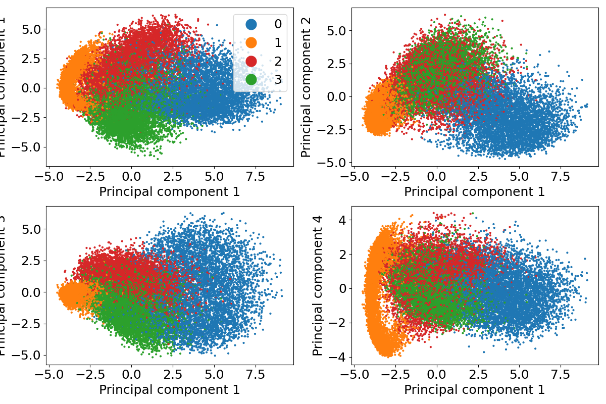

# PCA analysis on MNIST dataset

## dataset
Fetch raw data

    curl -O http://yann.lecun.com/exdb/mnist/train-images-idx3-ubyte.gz
    curl -O http://yann.lecun.com/exdb/mnist/train-labels-idx1-ubyte.gz

move these into dataset and and unzip

    gunzip t*-ubyte.gz

now to make it easily readable run

    python3 setup_dataset.py

which reformats the data in numpy format.

## Run PCA
Running 
    
    python pyscripts/run_pca.py

will perform basic pca and show the principal components.
Trying out clustering can be done via

    python pyscripts/run_clustering.py

## Demo

